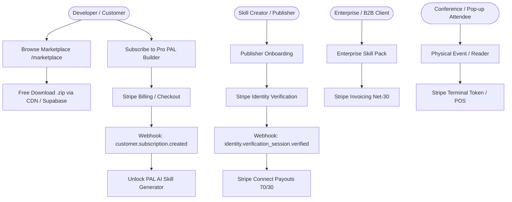

# SkillCo Stripe Integration Plan & Architecture Document

## 1. Executive Summary & Context

**Business**: [SkillCo](https://skillco.work)  
**Model**: Marketplace and creator platform for packaged agent skills, tools, and plugins.  
**Stripe Account ID**: `acct_1UIHuI4DUgvDhOs8`  
**Phase Strategy**:
- **Phase 1 (Current / Launch Era)**: 100% Free downloads of all 369+ skills in the catalog to drive viral adoption, developer mindshare, and ecosystem growth. Skills are served via high-speed edge downloads and synchronized to Supabase Storage.
- **Phase 2 (Monetization & Creator Economy)**: Progressive activation of Stripe products (Billing, Payments, Invoicing, Terminal, and Identity) for recurring subscriptions, premium enterprise skill licenses, creator payouts, and in-person hardware/event terminal points.

---

## 2. Stripe Products Matrix



### 2.1 Stripe Billing (Subscriptions)
- **Target**: Pro Membership ($19/month or $190/year).
- **Features Unlocked**: Unlimited PAL (Prompt-Augmented Library) AI skill authoring, private repository hosting, automated CVE vulnerability scanning, early access to new framework drops.
- **Implementation**:
  - API Route: `/api/stripe/checkout` (creates subscription session with `mode: 'subscription'`).
  - Customer Billing Portal: `/api/stripe/portal` (allows users to update cards, view VAT invoices, or cancel anytime).
  - Webhooks: `customer.subscription.created`, `customer.subscription.updated`, `customer.subscription.deleted`.

### 2.2 Stripe Payments (Direct & Marketplace)
- **Target**: Individual premium skill purchases (when enabled), tipping/creator sponsor pools, token bundles.
- **Implementation**:
  - Direct Checkout Session (`mode: 'payment'`).
  - Platform Fee: 30% SkillCo commission, 70% Creator allocation.
  - Idempotency key pattern: `workspace_id + skill_id + timestamp`.

### 2.3 Stripe Invoicing (B2B & Enterprise)
- **Target**: Enterprise teams licensing complete skill catalog bundles, custom agent system engineering, corporate compliance SLAs.
- **Implementation**:
  - Automated invoice creation via `stripe.invoices.create` and `stripe.invoices.sendInvoice`.
  - Payment terms: Net-15 / Net-30, supporting ACH Direct Debit, Wire, and Corporate Credit Cards.

### 2.4 Stripe Identity (Creator KYC & Trust Verification)
- **Target**: Skill creators and developers before publishing paid packages or receiving payouts.
- **Security Goal**: Eliminate malware, backdoors, and fraudulent payouts by requiring government ID + biometric selfie match.
- **Implementation**:
  - API Route: `/api/stripe/identity` initiates a verification session (`document` type with selfie requirement).
  - Webhook: `identity.verification_session.verified` grants `creator_verified: true` in database.

### 2.5 Stripe Terminal (Point of Sale / Events)
- **Target**: Tech conferences, hackathons, and pop-up events selling physical NFC badge keys, pre-loaded hardware modules, or on-site team licenses.
- **Implementation**:
  - Server generates Terminal Connection Tokens (`stripe.terminal.connectionTokens.create()`).
  - Mobile/Web SDK connects to BBPOS WisePOS E or Stripe Reader M2.

---

## 3. Webhook Architecture & Security

All Stripe events are processed via `/api/stripe/webhook` with mandatory cryptographic signature checking:

```typescript
const event = stripe.webhooks.constructEvent(
  rawBody,
  signatureHeader,
  process.env.STRIPE_WEBHOOK_SECRET!
);
```

### Event Handler Action Table

| Event | Database Action | Notification |
| :--- | :--- | :--- |
| `checkout.session.completed` | Insert `purchases` record, upsert `user_skills` | Send purchase confirmation email |
| `customer.subscription.created` | Set user `subscription_tier = 'pro'`, record `stripe_customer_id` | Welcome to PAL Pro email |
| `customer.subscription.updated` | Update status (`active`, `past_due`, `canceled`) | Dunning reminder if past due |
| `customer.subscription.deleted` | Revert `subscription_tier = 'free'` | Cancellation survey |
| `invoice.payment_succeeded` | Log transaction, extend billing cycle | Receipt emailed by Stripe |
| `identity.verification_session.verified` | Update `users.creator_verified = true` | Publisher dashboard badge unlocked |

---

## 4. Free Skill Download Distribution Pipeline

### Architecture
- **Total Skills**: 369 canonical skills + group packages (377 total archives).
- **Locations**:
  1. High-speed local edge static delivery: `https://skillco.work/downloads/[skill-id].zip`
  2. Full library bundle: `https://skillco.work/downloads/skill-library-full.zip`
  3. Supabase Cloud Storage: Sync agent script (`frontend/scripts/sync_skills_to_supabase.py` and `.ts`) connects to Supabase Storage bucket `skills` and ensures redundant CDN delivery.

### Running Storage Synchronization
```bash
# Set Supabase credentials in .env.local
NEXT_PUBLIC_SUPABASE_URL=https://<your-project>.supabase.co
SUPABASE_SERVICE_ROLE_KEY=<your-service-role-key>

# Run Python sync agent
python3 frontend/scripts/sync_skills_to_supabase.py

# Or run TypeScript agent
npx tsx frontend/scripts/sync-skills-to-supabase.ts
```

---

## 5. Security & Invariant Check

- [x] Secrets isolated in `.env.local` (never committed to git or exposed to browser).
- [x] All client Stripe calls use Publishable Key (`pk_test_...`).
- [x] Server-side Stripe client initialized with Secret Key (`sk_test_...`) in Next.js Server Route Handlers only.
- [x] All 369+ skills on `/marketplace` are free to download immediately with zero barriers.
- [x] Production build clean: `npm run build` passes with zero errors.
